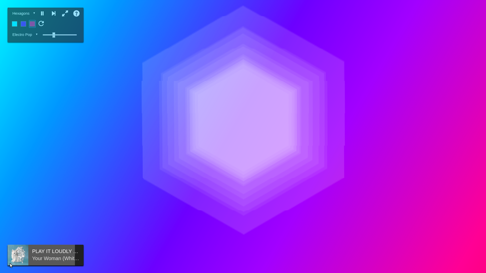

# CSS Music Visualizer

## About

This is a set of visualizers that are made entirely using DOM elements and CSS3 Animations and Transforms. **There is no SVG, Canvas, WebGL, or visual plug-in used.** It takes quite a bit of tweaking to reduce compositing and optimize rendering layers but this is the kind of stuff CSS can do now.

[**Live Demo**](http://likethemammal.github.io/css-visualizer)

*(Everything you see is made from div tags!)*

~~It uses [Dancer.js](https://github.com/jsantell/dancer.js) a small Web Audio library to get `spectrum` and `waveform` data using the HTML5 audio tag.~~

It uses the Web Audio API to decode audio data and pulls songs from the Soundcloud API based on what genre is selected.

#### Visualizers

There are currently ~~two~~ three types of visualizer:

 * The Hexagonal one, which utilizes spectrum data and uses `before` and `after` psudeo-elements to create the six-sided shape.
 * Bars, which projects the waveform data and uses the CSS3 transform `skew` to create the 3D column shape.
 * And Circles, which rotates a set of circles individually around the same point, with CSS a pattern for each of their backgrounds.

## Goals

~~It has a relatively simple UI but the plan is to connect it to the [SoundCloud](http://SoundCloud.com) and [Grooveshark](http://grooveshark.com) APIs to visualizer any song from those services.~~

Get Googlecast support working. But Googlecast doesn't support decoding mp3s through the Web Audio API, so some sort of audio data stream needs to created to send data over to the Cast device. Ideally without a server involed.

#### Visualizer Ideas

There are a few other visualizer ideas I'm toying with as well. As one of the restriction I've decided to only use traditional HTML DOM elements like `div`, `li`, etc.

If you come across any cool Codepens, patterns, or the like that are basically only use **HTML/CSS** to create a cool effect, let me know [@likethemammal](https://twiitter.com/likethemammal). Most stuff like that can be attached to oscilate or rotation over time to audio data.

More SoundCloud API functionality would be cool (liking a song, add to playlist, etc), but that requires logging users in and a UI for that. May take some time.

## Version 1.1 Updates

* Genre radio dropdown, hooked up to the [SoundCloud API](https://developers.soundcloud.com/)

* Volume slider (much wanted!)

* Album art and links to SoundCloud pages

* New visualizer, a circular rotating one

### License
All the code for this project was developed on my own and in my free-time.

Licensed under Apache License 2.0.

[@Likethemammal](https://github.com/likethemammal)
